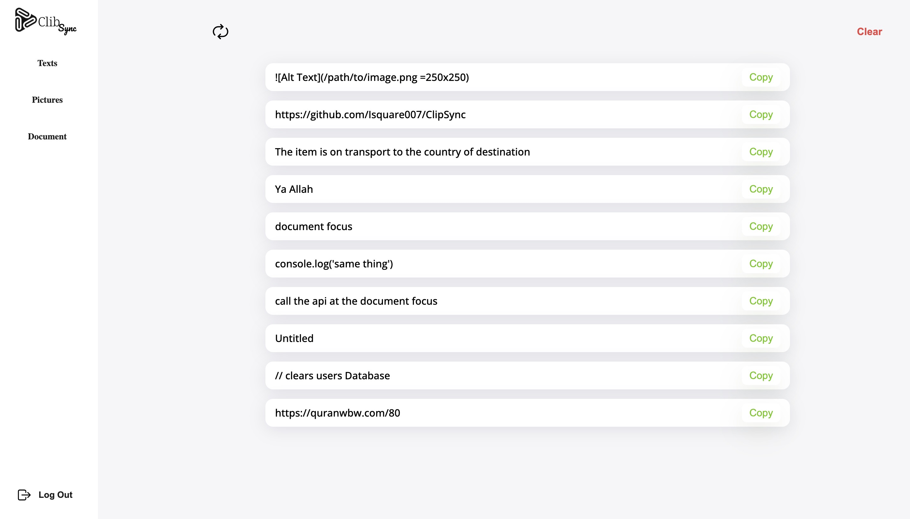

# ClibSync App
### Copy once, paste everywhere with ease!

 The purpose of this project is to develop a clipboard sync application that allows users to copy and paste text or files across multiple devices seamlessly. The application will provide a centralized location for storing and accessing copied data from any device, making it easy to transfer information between different platforms and devices. You don’t have to copy texts into your messenger to access them on your computer.

 ## Installation
 * clone this repo
 ```
 https://github.com/Isquare007/ClipSync
 ```
 * Access the directory
 ```sh
 cd vue/clibsync
 ```
 ### Install NPM :
 ```sh
 npm install
 ```
 ### To run dev server :
```sh
npm run dev
```
### TO run production server:
```sh
sudo npm i -g serve
``` 
```sh
serve -s dist
```

<center>:tada: Viola the app is life!!! :tada:</center>




## Bugs
No known bugs at this time

## Authors
Ibrahim Ibrahim - [Github](https://github.com/Isquare007) / [Twitter](https://twitter.com/ibrahhiiiiim) / [LinkedIn](https://www.linkedin.com/in/ibrahim-ibrahim-010b2a23a/)

Oluwatofunmi Akinola - [Github](https://github.com/carvanino) / [Twitter](https://twitter.com/belac_0023) / [LinkedIn](https://www.linkedin.com/in/oluwatofunmi-ac/)

## Related Projects
* [AirBnB Clone](https://github.com/carvanino/AirBnB_clone_v3) - a simple web app made in Python, Flask, and JQuery.

## License
Private Domain. Copy write protection